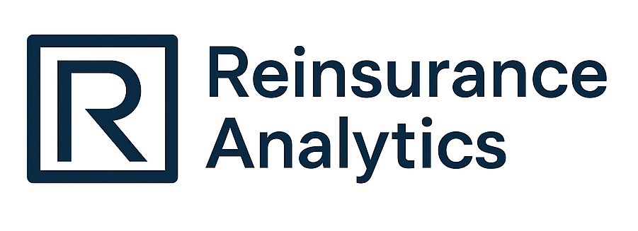

# **Transparent Market Platform — YC Demo**

🚀 **AI-Powered, Clause-Grounded, Auditable Treaty Bidding**

This Streamlit demo showcases **Reinsurance Analytics**:
A **transparent market platform** that combines:

* **Open Treaty Bidding** – Multi-Agent Reinforcement Learning (MARL)
* **ClauseLens** – Clause-grounded quote explanations for regulatory transparency
* **MarketLens** – Market benchmarking & fairness dashboards
* **Governance Layer** – Human-in-the-loop oversight and audit logging

---

## **📸 App Preview**

| Live Treaty Bidding | MarketLens Dashboard | ClauseLens Explanations |
| ------------------- | -------------------- | ----------------------- |
|    | *(Add screenshots)*  | *(Add screenshots)*     |

---

## **📦 Project Structure**

```
transparent-market-demo/
│
├── app.py                 # Main Streamlit app entry point
├── requirements.txt       # Python dependencies
├── logo.png               # App logo
├── README.md              # Project documentation
├── data/                  # demo datasets
└── .streamlit/
    └── config.toml        # UI theme settings
```

---

## **▶️ Run Locally**

1. Clone this repository:

   ```bash
   git clone https://github.com/YOUR_USERNAME/transparent-market-demo.git
   cd transparent-market-demo
   ```

2. (Optional) Create a virtual environment:

   ```bash
   python -m venv venv
   source venv/bin/activate  # On Windows: venv\Scripts\activate
   ```

3. Install dependencies:

   ```bash
   pip install -r requirements.txt
   ```

4. Run the app:

   ```bash
   streamlit run app.py
   ```

5. Open **[http://localhost:8501](http://localhost:8501)** in your browser.

---

## **☁️ Deploy to the Cloud**

### **Option 1: Streamlit Cloud**

1. Push this project to GitHub.
2. Go to [https://share.streamlit.io](https://share.streamlit.io).
3. Click **New App → Select Repository → app.py**.
4. Deploy!

Your app will be live at:

```
https://your-username-transparent-market-demo.streamlit.app
```

---

### **Option 2: Hugging Face Spaces**

1. Create a **New Space → Streamlit**.
2. Upload the following files:

   ```
   app.py
   requirements.txt
   logo.png
   README.md
   ```
3. Hugging Face will auto-build and host your demo.

---

### **Option 3: Embed in Squarespace**

Once deployed, embed your app via `<iframe>`:

```html
<iframe 
    src="https://your-app-url.streamlit.app"
    width="100%" 
    height="900" 
    frameborder="0"
    allowfullscreen>
</iframe>
```

---

## **⚙️ Features in the Demo**

* **📈 Live Treaty Bidding**

  * Simulated MARL agents competing under CVaR constraints
  * Real-time streaming bids

* **📄 ClauseLens Explanations**

  * Clause-grounded justifications for each quote
  * Helps satisfy Solvency II / IFRS 17 compliance

* **📊 MarketLens Dashboard**

  * Market benchmarking, fairness, and loss ratio analysis

* **🛡 Governance Layer**

  * Counterfactual logs
  * Human-in-the-loop approvals and overrides

---

## **💡 Notes**

* The demo uses **synthetic and anonymized data** for compliance.
* Full MARL training and large ML models can be run locally for advanced simulations.
* Optional: Enable `torch` and `transformers` in `requirements.txt` for local experiments.

---

## **📜 License**

MIT License – free for research and non-commercial use.


